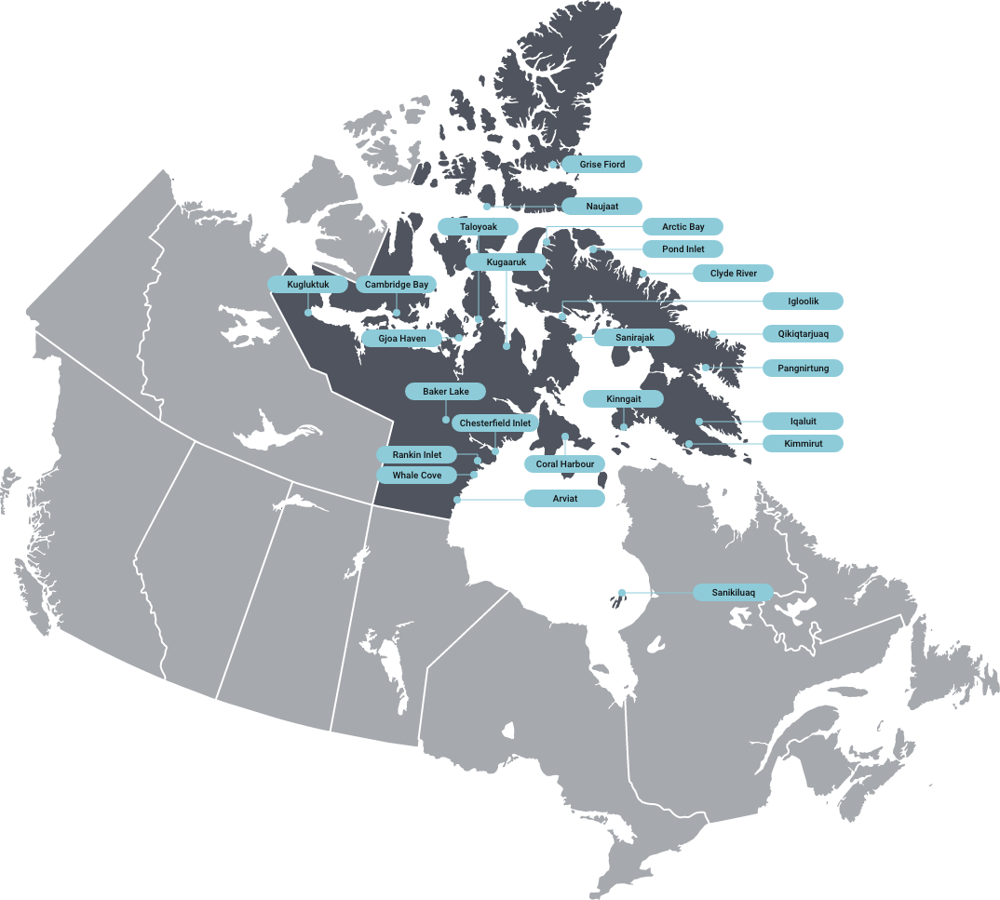

Nunavut, or “Our Land” in Inuktitut, encompasses over 2 million km2 and has a population of 36,858 residents (2021 census), 30,865 of whom are Inuit. Covering roughly the part of the Canadian mainland and Arctic Archipelago that lies to the north and northeast of the treeline, Nunavut is the largest and northernmost territory of Canada and the fifth largest administrative division in the world. Nunavut covers 1,936,113 km2 of land and 157,077 km2 of water in Northern Canada, representing 21 percent of the country’s total area. The territory includes part of the mainland, most of the Arctic Archipelago, and all of the islands in Hudson Bay, James Bay and Ungava Bay. Nunavut is divided by three of Canada’s seven physiographic regions. These regions are the Hudson Bay Lowlands, the Canadian Shield and the Arctic Lands.

Much of the land in Nunavut is characterized as tundra, which is bare, rocky and treeless. The soil of the tundra is locked in permafrost. The Arctic is experiencing climate warming faster and more intensely than most other parts of the world. Changes in Nunavut include higher temperatures, melting permafrost, reduced sea ice, thinning and retreating glaciers and diminished ice shelves. These changes threaten polar bears, seals, walruses, caribou and many other species on which traditional Inuit harvesting practices depend.
